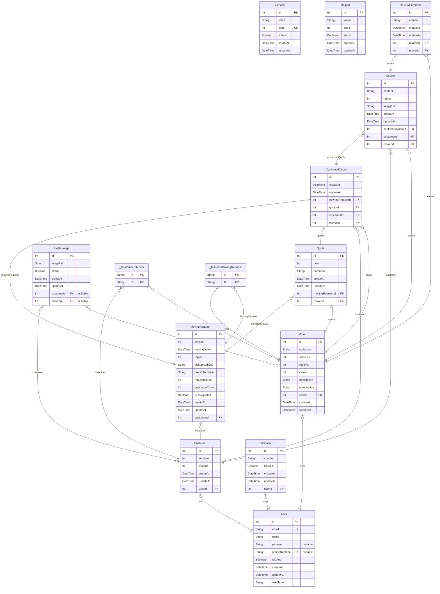

# Sinchon ICPC Camp ERD
> Generated by [`prisma-markdown`](https://github.com/samchon/prisma-markdown)

- [default](#default)

## default

### `User`

**Properties**
  - `id`: 
  - `email`: 
  - `name`: 
  - `password`: 
  - `phoneNumber`: 
  - `isOAuth`: 
  - `createAt`: 
  - `updateAt`: 
  - `userType`: 

### `Customer`

**Properties**
  - `id`: 
  - `services`: 
  - `regions`: 
  - `createAt`: 
  - `updateAt`: 
  - `userId`: 

### `Mover`

**Properties**
  - `id`: 
  - `nickname`: 
  - `services`: 
  - `regions`: 
  - `career`: 
  - `description`: 
  - `introduction`: 
  - `userId`: 
  - `createAt`: 
  - `updateAt`: 

### `Service`

**Properties**
  - `id`: 
  - `value`: 
  - `code`: 
  - `status`: 
  - `createAt`: 
  - `updateAt`: 

### `Region`

**Properties**
  - `id`: 
  - `value`: 
  - `code`: 
  - `status`: 
  - `createAt`: 
  - `updateAt`: 

### `MovingRequest`

**Properties**
  - `id`: 
  - `service`: 
  - `movingDate`: 
  - `region`: 
  - `pickupAddress`: 
  - `dropOffAddress`: 
  - `requestCount`: 
  - `designateCount`: 
  - `isDesignated`: 
  - `createAt`: 
  - `updateAt`: 
  - `customerId`: 

### `Quote`

**Properties**
  - `id`: 
  - `cost`: 
  - `comment`: 
  - `createAt`: 
  - `updateAt`: 
  - `movingRequestId`: 
  - `moverId`: 

### `ConfirmedQuote`

**Properties**
  - `id`: 
  - `createAt`: 
  - `updateAt`: 
  - `movingRequestId`: 
  - `quoteId`: 
  - `customerId`: 
  - `moverId`: 

### `Review`

**Properties**
  - `id`: 
  - `content`: 
  - `rating`: 
  - `imageUrl`: 
  - `createAt`: 
  - `updateAt`: 
  - `confirmedQuoteId`: 
  - `customerId`: 
  - `moverId`: 

### `notification`

**Properties**
  - `id`: 
  - `content`: 
  - `isRead`: 
  - `createAt`: 
  - `updateAt`: 
  - `userId`: 

### `ReviewComment`

**Properties**
  - `id`: 
  - `content`: 
  - `createAt`: 
  - `updateAt`: 
  - `reviewId`: 
  - `moverId`: 

### `ProfileImage`

**Properties**
  - `id`: 
  - `imageUrl`: 
  - `status`: 
  - `createAt`: 
  - `updateAt`: 
  - `customerId`: 
  - `moverId`: 

### `_CustomerToMover`
Pair relationship table between [Customer](#Customer) and [Mover](#Mover)

**Properties**
  - `A`: 
  - `B`: 

### `_MoverToMovingRequest`
Pair relationship table between [Mover](#Mover) and [MovingRequest](#MovingRequest)

**Properties**
  - `A`: 
  - `B`: 